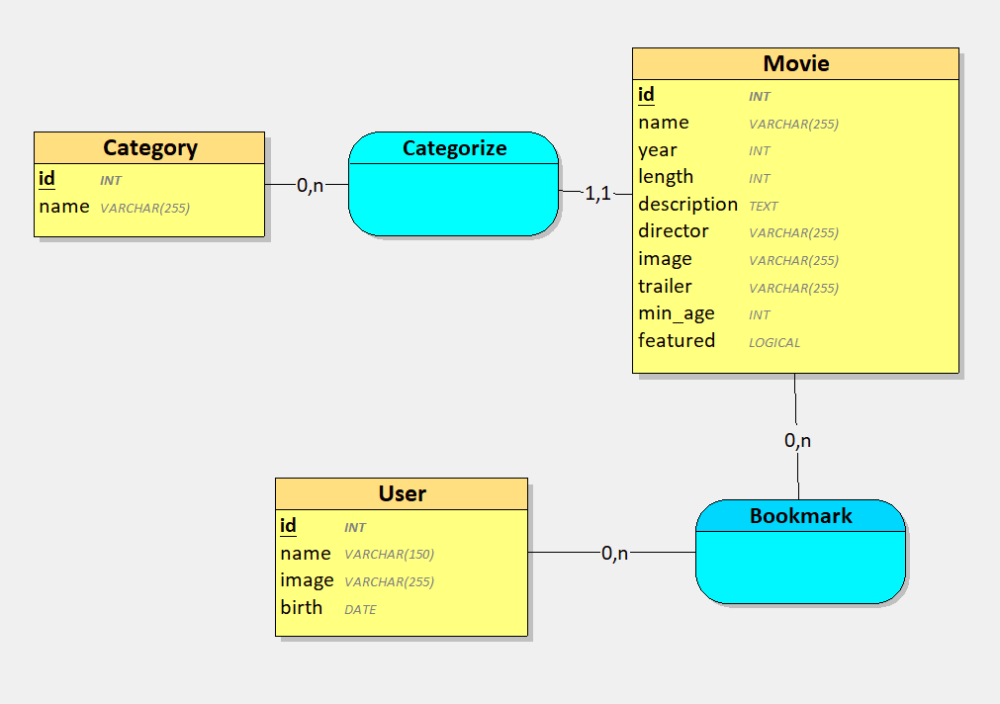

# Structure de la base de données

La base de données comprend quatre tables principales : Movie, Category, User et Bookmark.

MCD:



## Itérations du projet

### ITÉRATION 1 : Consulter la liste des films
Pour cette première itération, la table `Movie` qui contient les informations sur les films était déjà créer.

**Requête SQL :**
```sql
SELECT * FROM Movie
```

### ITÉRATION 2 : Ajouter des films dans la base de données
Pour cette itération, j'ai implémenté la fonction qui permet d'ajouter de nouveaux films.

**Requête SQL :**
```sql
INSERT INTO Movie (name, year, length, description, director, id_category, image, trailer, min_age, featured) 
VALUES (:name, :year, :length, :description, :director, :id_category, :image, :trailer, :min_age, :featured)
```

### ITÉRATION 3 : Consulter les informations détaillées d'un film et son trailer
J'ai ajouté cette requête pour avoir accès aux informations du film selon son id et donc par une jointure pour avoir le nom de sa catégorie.

**Requête SQL :**
```sql
SELECT Movie.id, Movie.name, Movie.year, Movie.length, Movie.description, Movie.director, 
Movie.image, Movie.trailer, Movie.min_age, Category.id AS category_id, Category.name AS category
FROM Movie JOIN Category ON Movie.id_category = Category.id 
WHERE Movie.id = :id
```

### ITÉRATION 4 : Afficher les films par catégorie
Pareille la table `Category` était déjà créer. Concernant les cardinalités, un film appartient à exactement une catégorie (1,1), tandis qu'une catégorie peut contenir plusieurs films ou aucun (0,n). Dans le MLD, cette relation se traduit par l'ajout d'une clé étrangère `id_category` dans la table `Movie`, car c'est le côté (1,1) qui reçoit la clé étrangère.

**Requêtes SQL :**
```sql
-- Pour récupérer les catégories
SELECT id, name AS category FROM Category

-- Pour récupérer les films d'une catégorie
SELECT Movie.id, Movie.name, Movie.year, Movie.length, Movie.description, Movie.director, 
Movie.image, Movie.trailer, Movie.min_age, Category.id AS category_id, Category.name AS category
FROM Movie JOIN Category ON Movie.id_category = Category.id 
WHERE Category.name = :category AND Movie.min_age <= :userAge
```

### ITÉRATION 5 : Ajouter des profils utilisateur
Création de la table `User` pour stocker les profils. Le champ `birth` est de type DATE pour faciliter le calcul précis de l'âge des utilisateurs, essentiel pour le filtrage de contenu par âge.

**Requête SQL :**
```sql

CREATE TABLE User (
	id INT PRIMARY KEY AUTO_INCREMENT,
    name VARCHAR(150) NOT NULL,
    image VARCHAR(255) NOT NULL DEFAULT 'no_avatar.jpg',
    birth DATE NOT NULL
);

INSERT INTO User (name, image, birth) VALUES (:name, :image, :birth)
```

### ITÉRATION 6 : Choisir un profil utilisateur
Cette itération n'a pas nécessité de modifications structurelles de la base de données.

**Requêtes SQL :**
```sql
-- Pour récupérer tous les profils
SELECT * FROM User

-- Pour récupérer un profil spécifique
SELECT id, name, image, birth FROM User WHERE id = :id
```

### ITÉRATION 8 : Modifier un profil utilisateur
Cette itération n'a pas nécessité de modifications.

**Requête SQL :**
```sql
UPDATE User SET name = :name, image = :image, birth = :birth WHERE id = :id
```

### ITÉRATION 9 : Ajouter des films aux favoris
Pour cette fonctionnalité, j'ai créé la table `Bookmark`. Au niveau des cardinalités, un utilisateur peut avoir plusieurs favoris ou aucun (0,n), et un film peut être mis en favori par plusieurs utilisateurs ou aucun (0,n). Cette relation (n,n) doit donc devenir une table dans le MLD.

La table `Bookmark` contient deux clés étrangères : `id_user` et `id_movie`, qui forment ensemble une clé primaire . Ce choix permet qu'un utilisateur ne peut pas ajouter deux fois le même film à ses favoris.

**Requêtes SQL :**
```sql
-- Vérification si le favori existe déjà
SELECT COUNT(*) FROM Bookmark WHERE id_user = :id_user AND id_movie = :id_movie

-- Ajout d'un favori
INSERT INTO Bookmark (id_user, id_movie) VALUES (:id_user, :id_movie)

-- Récupération des favoris d'un utilisateur
SELECT Movie.* FROM Bookmark JOIN Movie ON Bookmark.id_movie = Movie.id 
WHERE Bookmark.id_user = :id_user
```

### ITÉRATION 10 : Retirer un film des favoris
Cette itération utilise la table `Bookmark` déjà créée.

**Requête SQL :**
```sql
DELETE FROM Bookmark WHERE id_user = :id_user AND id_movie = :id_movie
```

### ITÉRATION 11 : Mettre en avant des films
Ajout du champ `featured` à la table `Movie`. J'ai choisi le type TINYINT(1) qui fonctionne comme un booléen : 0 pour les films normaux, 1 pour les films mis en avant.

**Requête SQL :**
```sql

ALTER TABLE Movie ADD featured TINYINT(1) NOT NULL DEFAULT 0;

SELECT * FROM Movie WHERE featured = 1 ORDER BY id DESC
```

### ITÉRATION 12 : Ajouter un champ de recherche
Cette itération n'a pas nécessité de modifications.

**Requête SQL :**
```sql
SELECT * FROM Movie WHERE LOWER(name) LIKE LOWER(:query)
```


## Justification des relations
- **Movie - Category** : Un film a seulement une catégorie (1,1), une catégorie peut avoir 0 ou plusieurs films (0,n). La clé étrangère se trouve dans la table Movie (côté 1,1).
- **User - Movie** (via Bookmark) : Un utilisateur peut mettre en favori plusieurs films (0,n), un film peut être mis en favori par plusieurs utilisateurs (0,n). Cette relation n,n nécessite la table de liaison Bookmark.

## Structure finale des tables

- **Movie** : id (PK), name, year, length, description, director, id_category (FK), image, trailer, min_age, featured
- **Category** : id (PK), name
- **User** : id (PK), name, image, birth
- **Bookmark** : id_user (PK, FK), id_movie (PK, FK)